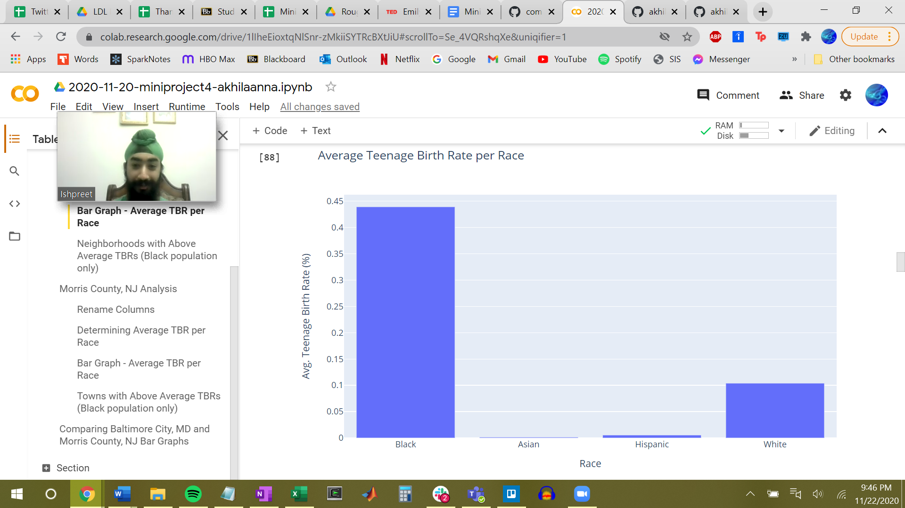
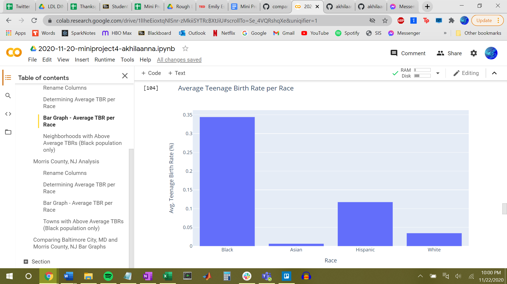
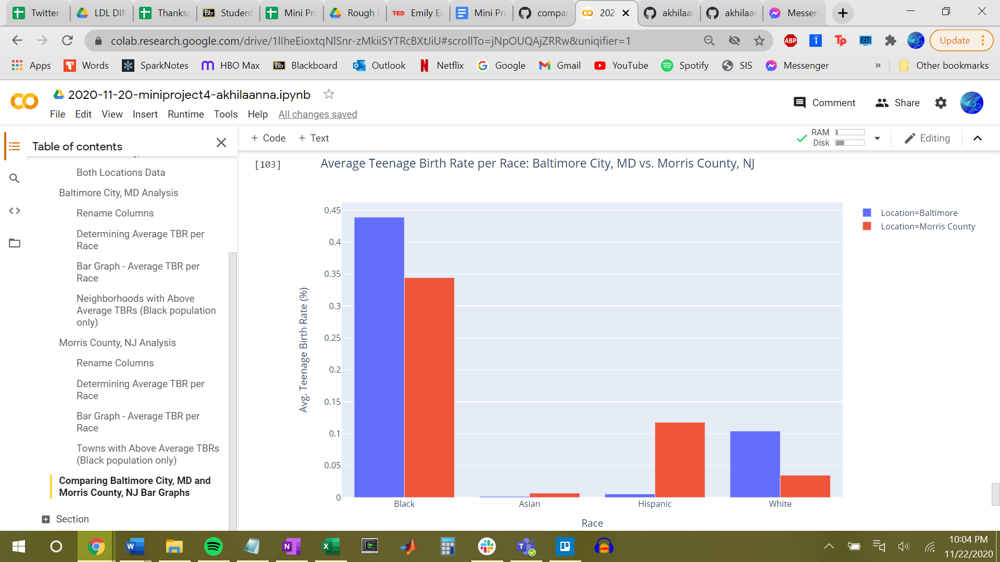

# Comparing Teenage Birth Rates Between Baltimore City, MD and Morris County, NJ by Race Using Python

## Background Information 

Baltimore City, MD is a metropolitan area in Maryland. While some neighborhoods are primarily wealthy, others struggle economically. This affects many aspects of the city's residents' lives, including their access to education, housing and food security, and more.

In contrast, Morris County, NJ is a suburban area mostly comprised of people who have reached relatively high socioeconomic statuses. It has been named one of New Jersey's most affluent counties regularly.

I thought it would be interesting to compare an aspect of the residents' lives between Baltimore and Morris County. Since I enjoy learning about maternal and child health, I decided to analyze teenage birth rates in these two locations. I also wanted to consider if race plays a role in the rates.

## Business Question 

How do the teenage birth rates between Baltimore City, MD and Morris County, NJ compare and how does race affect the results?

## Data Process & Analysis 

I downloaded data from [Opportunity Atlas](https://www.opportunityatlas.org/) on the teenage birth rates for Black, Asian, Hispanic, and White populations for both Baltimore City, MD and Morris County, NJ. I downloaded the data into Excel (one workbook for each location) as CSV files. I uploaded the CSV files to Github and then imported the URL for the raw CSV data when coding in Python. 

I did the coding for Python in Google Colaboratory. [This link ](https://colab.research.google.com/drive/1lIheEioxtqNlSnr-zMkiiSYTRcBXtJiU#scrollTo=vCefxjqitPpe&uniqifier=1) provides all the code. 

In order to answer this business question, I did the following: 

I worked with one location at a time. I first worked completely with Baltimore City, MD. I found the average teenage birth rates (TBRs) for each race: Black, Asian, Hispanic, and White and graphed the data into a bar chart. The x-axis was race and the y-axis was the corresponding TBR. 

*This is the bar chart for Baltimore City, MD* 

 

*Meaning*: This graph shows that the black population has a significantly higher average TBR than the other races. The next highest TBR is the white population, but it is 30% lower than the black population's TBR, showing how large the black population TBR is. The Hispanic and Asian populations have very small average TBRs, but this may because there are fewer people of these races living in Baltimore.

I did the same process for Morris County, NJ. 

*This is the bar chart for Morris County, NJ:* 

 

*Meaning*: Similar to Baltimore City, this graph shows that the black population has a significantly higher average TBR than the other races. The next highest TBR is the Hispanic population, but it is 20% lower than the black population's TBR, showing how large the black population's TBR is. The Hispanic and Asian populations have very small average TBRs, but not an extremely low amount as it was for Baltimore City.

I then compared the two locations by grouping the two separate charts together. 

*This is the combined bar chart for both locations:*

 

*Meaning*: This graph shows how the two locations compare. For both locations, the black population has the highest average TBR. But the race for the second highest average TBR differs for each location, with Baltimore City's being white and Morris County's being Hispanic. Another important observation to note is that the average TBRs for the Asian and Hispanic populations for higher in Morris County than in Baltimore City, which suggests that Morris County needs to act more on this matter for Hispanics and Asians than Baltimore City needs to.

Since the average TBR was highest for the black population for both locations, I filtered the data to only display neighborhoods/towns that had TBRs above the average for each location. I only looked at the black population. 

From this, I learned that when looking at just black populations, 38.68% of neighborhoods in Baltimore City, MD have teenage birth rates higher than the average rate for the city as a whole and 21.01% of towns in Morris County, NJ have teenage birth rates higher than the average rate for the city as a whole. 

## Business Answer 

Teenage birth rates for Baltimore City, MD are generally higher than Morris County, NJ overall. The Asian and Hispanic populations have higher rates in Morris County, but the overall TBRs are still higher for Baltimore City given the significantly higher rates for the black and white populations in Baltimore. It is consistent between each location that the black population has the highest rates of teenage births, followed by the other races. 

## Recommendations 

The data analysis shows that both locations have the highest TBRs for the black population, so both locations need to act upon the issue for their black populations. The analysis of filtering the data to only display neighborhoods and towns above the average helps the locations prioritize who they focus most of their attention to. Officials in Baltimore City must attend to the 38.68% of neighborhoods that are above average, and Morris County must attend to the 21.01% of towns that are above average. For future research, I would like to continue onto this and determine which neighborhoods and towns fall under the 38.68% and 21.01% with especially high TBRs. This can be done with geospatial analysis. 

As for how to aid the communities that have significantly high TBRs, the city and county officials need to improve the quality of the sex education system, accessibility of convenience stores that sell birth control, and better care for those in vulnerable situations, such as an abusive relationship where sexual violence is very high. 

## Comparing Excel and Python 

While I am more familiar and comfortable with Excel, I think that Python is a better way to analyze data, especially large datasets. I appreciated how I could organize my work through Google Colaboratory using headings and notes, which I could not do in Excel. It was nice to be able to have one place where all my data was and another place where my analysis was, as opposed to Excel where the data and analysis are right next to each other. Python in general was easier for data manipulation. When filtering out data, it was nice to have a preview of what my code did and be able to easily undo that code if it didn't do what I thought it would. It is just much simpler to play around with different aspects of data analysis in Python than in Excel. 

One drawback of Python, however, is the increased difficulty in creating data visualizations. In Excel, it is very simple to create charts from data, but it was much harder to do the same thing in Python. I do think that it takes some time to get used to it. As of now, I feel that it is easier to create and format charts in Excel because I spent much of my life working with it, and only just started learning Python. For example, I thought that having to manually code titles, labels, and other formatting in Python was a little tedious, but I am sure that with more practice it will become just as easy as Excel, making it a truly better option for data analysis. 

